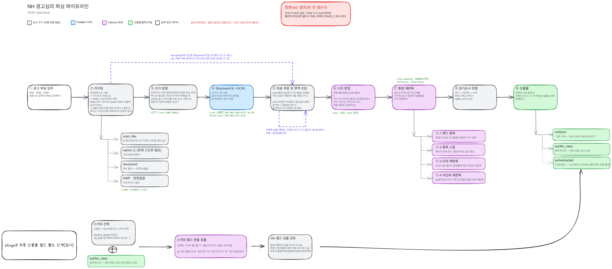

# NH 광고심의 PoC

AI 활용 금융상품 광고심의 적정성 검토 에이전트 (NH농협은행 PoC, 씨지인사이드).

## 현재 상태

파싱(광고물 → 구조화 IR) + STAGE_3 스키마 추출(구조화 필드) 프로토타입.
심의 판정(위반 여부 산정)은 아직 없음 — 자세한 경계는
[docs/handoff.md](docs/handoff.md) §6 참조.

**최신 실행: 2026-08-06 무캐시 · 5문서 7페이지**

| 지표 | 값 | 도구 |
|---|---|---|
| 분류 | 9/9 | `evaluate.py` |
| 영역검출 | 43/44 | `evaluate.py` |
| 문장 회수 | 237/242 | `evaluate.py` |
| 필드 회수 | 43/44 (실행마다 42~43) | `verify_extract.py` |
| 파싱 소요 | 496초 (VLM 대기 96.7%) | `run_nhdata.py` |
| 테스트 | 167 passed | `pytest` |

**8/6 에 무엇을 바꿨는지는 [docs/변경정리_2026-08-06.md](docs/변경정리_2026-08-06.md)** 를
먼저 읽으면 된다 — 쉬운 말로 정리해 두었다.

## 실행

```bash
uv sync                                # Python 3.13 + 의존성 (사내 파서 포함, Java 필요)

# 1단계: 파싱 (광고물 → out/json, out/llm_view, out/_timing.json)
uv run python tools/run_nhdata.py                # 기본 입력이 nh-data/sample-data

# 2단계: STAGE_3 스키마 추출 (out/llm_view → out/extracted)
uv run python tools/run_extract.py

# 채점 — 파싱 품질(분류/영역/문장)과 필드 회수는 서로 다른 도구가 잰다
uv run python tools/evaluate.py         # gold/*.yaml 대비 → out/eval_report.md
uv run python tools/verify_extract.py   # out/extracted 대비 필드 회수
uv run python tools/verify_numbers.py   # 문서에 쓰는 모든 숫자를 out/ 에서 재계산 (모델 0회)

# 육안 검수 — 원본 위 bbox 하이라이트 + OCR/VLM 판독 대조
uv run python tools/make_review.py      # → out/review.html

# 팀원에게 공유할 스냅샷 (out/ 는 gitignore 대상이라 밖으로 빼서 저장)
uv run python tools/make_review.py --out docs/review.html

# 인쇄·PDF 용 (미팅에 종이로 들고 갈 때) — 접힌 토글을 전부 펼치고 A4 1단으로
uv run python tools/make_review.py --for-print --out out/review_print.html
#   → 브라우저에서 Ctrl+P → "PDF로 저장". 전체 118쪽 / --parsing-only 96쪽 /
#     --only "올원e" 27쪽 (실측 2026-08-07)
```

`review.html` 은 원본 이미지·OCR/VLM 판독 결과를 **base64 로 파일 안에 그대로 내장**한다
(모든 페이지 이미지 포함 5MB 안팎) — 폴더 없이 파일 하나만 보내도 그대로 열린다.
[docs/review.html](docs/review.html) 은 2026-08-06 실행 스냅샷이다 — **재실행하면 갱신되지
않으니**, 최신 결과가 필요하면 위 명령을 다시 돌려 덮어써야 한다.

외부 서비스(PaddleX/Gemma)는 사내 엔드포인트 — [.env.example](.env.example) 참고.
`VLM_CACHE=r`(기록)/`=p`(재생) 환경변수로 결정론적 A/B가 가능하다(개발 전용).

> ⚠️ **`GEMMA_MODEL` 이름을 먼저 확인할 것.** 게이트웨이가 모델명을 바꾸면 **모든 VLM 호출이
> 400 으로 죽는데 OCR 은 멀쩡히 돌아 산출물이 그럴듯하게 나온다** (2026-08-06 실제 사고 —
> `gemma-4-26b-…` → `spark-gemma-4-26b-…`). 지금은 `run_nhdata.py` 가 이런 실행을 `exit 1`
> 로 잡지만, 확실한 건 직접 대조하는 것이다:
> ```bash
> curl -s "${GEMMA_URL%/chat/completions}/models"   # 사용 가능한 이름 목록
> ```

## 코드 맵 (src/nh_parsing/)



> 상자별 설명은 [docs/architecture/pipeline-diagram-guide.md](docs/architecture/pipeline-diagram-guide.md).

### 파싱 파이프라인 (`tools/run_nhdata.py` → `pipeline.py`)

| 모듈 | 역할 |
|---|---|
| `pipeline.py` | 전체 라우팅·조립 — 파일별 트랙 진입점, 밴드 통합판독, 미배정 귀속 |
| `triage.py` | PDF 페이지 단위 structured/scan_like/hybrid 판정 + 디지털 라인 추출 |
| `canvas.py` | 입력 정규화 (이미지/PDF → 캔버스, scan_like 는 네이티브 DPI 렌더) |
| `bands.py` | 글자밀도 기반 분할 — 타일링·스윕·카드 개수 판정의 공통 primitive |
| `tiling.py` | 밀도 분할 기반 타일 생성 + 좌표 복원 + 중복 제거 |
| `paddlex_client.py` | PP-StructureV3 호출 (레이아웃 + OCR) |
| `regions.py` | 레이아웃 블록 → 영역(Region) 조립 |
| `gemma_client.py` | VLM 공용 호출(chat_json) + 분류 + 호출 비용 계측 |
| `vlm_judge.py` | 영역 역할 판정 (섹션 판정·미배정 VLM 귀속은 2026-08-03 제거) |
| `cards.py` | 카드-분할 — 개수는 밀도(코드), 배정은 VLM |
| `vlm_direct.py` | 밴드 통합판독, 스윕, 저신뢰 재판독 |
| `truncation.py` | OCR 정본 vs VLM 후보의 관계 판정 (잘림/생략/회수/불일치) |
| `layout_gap.py` | 레이아웃이 통째로 놓친 블록 진단 (감지만, 자동 승격 없음) |
| `field_judge.py` | `check_field_consistency` — 값이 원문에 실재하는지 검산 |
| `hwp_ingest.py` | 사내 파서(document-processor)로 HWP 디지털 추출 (표는 구조 API 우선) |
| `assets.py` | 내장 이미지(ImageAsset) 공용 헬퍼 |
| `ir.py` | AdPageIR 스키마 (pydantic) |
| `config.py` | 실행 설정 (환경변수 기반) |
| `vlm_cache.py` | VLM 응답 기록/재생 — A/B 결정론 장치 (개발 전용) |

### STAGE_3 스키마 추출 (`tools/run_extract.py` → `extract.py`)

| 모듈 | 역할 |
|---|---|
| `extract.py` | `out/llm_view` → 스키마 기반 필드 추출. 호출그룹 분할, 부재 판정, 근거 검증 |
| `extract_models.py` | STAGE_3 응답의 pydantic 계약 — 서버가 계약 밖 값을 보내면 그 그룹만 스킵 |
| `applicability.py` | 부재 4분류(해당없음/미표시/확인필요/판정제외) — 스키마 메타데이터를 코드로 평가 |
| `llm_view.py` | `out/json` → STAGE_3 입력 정제본 (좌표 제거, 판독 관계 딱지 부착) |
| `schema_pack.py` | `schemas/*.json` 로드 + 오버레이 합성 + strict json_schema 생성 |

**스키마 데이터는 `src/nh_parsing/schemas/`** 에 있다 (2026-08-06 에 저장소 루트에서
패키지 안으로 옮겼다 — 설치본에서도 찾히게):

| 파일 | 내용 |
|---|---|
| `예금성.json` | 상품군 스키마 — 호출그룹·필드·의무등급 |
| `_overlay_이벤트.json` | 이벤트페이지일 때 덧붙는 오버레이 |
| `_product_group_fields.json` | 근거 대장 — 규정 조문 ↔ 필드 매핑. `check_coverage()` 가 이걸로 누락을 검사 |

### 별도 트랙 (파싱 파이프라인과 무관)

| 모듈 | 역할 |
|---|---|
| `rag_ingest.py` | `tools/run_ragdata.py` 전용 — 규정 원문 → RAG 청크 + 이미지 캡션 (스키마 근거 도출용) |

## 도구 (tools/)

| 도구 | 하는 일 | 모델 호출 |
|---|---|---|
| `run_nhdata.py` | 파싱 — 광고물 → `out/json` · `out/llm_view` · `out/_timing.json` | **필요** |
| `run_extract.py` | STAGE_3 — `out/llm_view` → `out/extracted` | **필요** |
| `run_ragdata.py` | 규정 원문 → RAG 청크 (별도 트랙) | **필요** |
| `run_schema_source.py` | 규정 문서 → 원본 파싱 결과 (스키마 도출 근거용) | 없음 |
| `verify_numbers.py` | 문서에 쓰는 모든 숫자를 `out/` 에서 재계산 | 없음 |
| `evaluate.py` | 골드셋 채점 — 분류·영역검출·문장 회수 | 없음 |
| `verify_extract.py` | 골드셋 채점 — 필드 회수 | 없음 |
| `make_review.py` | 육안 검수 화면 `out/review.html` 생성 | 없음 |
| `rebuild_views.py` | `out/json` → `out/llm_view` 재생성 (파싱은 안 다시 함) | 없음 |
| `reclassify_absences.py` | 부재 4분류를 스키마 메타로 재계산 (스키마 수정 후 검증용) | 없음 |

## 문서

**무엇을 알고 싶은지에 따라 고르면 된다.**

| 알고 싶은 것 | 문서 |
|---|---|
| **이 저장소가 무엇이고 어떻게 흐르나** (PR·인수인계 설명용) | ⭐ [docs/흐름과_인수인계_2026-08-06.md](docs/흐름과_인수인계_2026-08-06.md) |
| **8/6 에 무엇을 왜 바꿨나** (쉬운 말) | ⭐ [docs/변경정리_2026-08-06.md](docs/변경정리_2026-08-06.md) |
| **실제로 무엇이 나왔나** (숫자·시간·사례) | [docs/parsing-output-report.md](docs/parsing-output-report.md) |
| **코드가 실제로 무엇을 하나** (좌표·실값으로 끝까지) | [docs/architecture/pipeline-walkthrough.md](docs/architecture/pipeline-walkthrough.md) |
| **인계 시 정할 것** (스키마·DB·RAG 경계) | [docs/handoff.md](docs/handoff.md) |
| 스키마 내부 구조 상세 | [docs/schema-explained.md](docs/schema-explained.md) |
| 검수 화면(review.html) 읽는 법 | [docs/screen-guide-review-html.md](docs/screen-guide-review-html.md) |
| 검수 화면 실물 (팀 공유용 스냅샷, 8/6) | [docs/review.html](docs/review.html) |
| 다이어그램 캔버스 동반 설명 | [docs/architecture/pipeline-diagram-guide.md](docs/architecture/pipeline-diagram-guide.md) (이미지는 코드 맵 위쪽 참조) |
| **붙일 때 무엇이 막히나** (필드 대응표·해법) | ⭐ [docs/pr-plan-2026-08-07.md](docs/pr-plan-2026-08-07.md) |
| 팀장님 레포(nh-ad-compliance)와의 비교 | [docs/compare-nh-ad-compliance.md](docs/compare-nh-ad-compliance.md) (§11 에 8/7 재확인) |

**갱신하지 않는 옛 문서** — 어긋나는 지점은
[walkthrough §10](docs/architecture/pipeline-walkthrough.md) 에 모아 두었다:
`docs/architecture/pipeline-map.md` · `docs/발표대본_2026-08-04.md` ·
`docs/notion_파싱파이프라인-output_2026-08-03.md` · [docs/previous/](docs/previous/)

## 참고 저장소

- `cginside/repo-analysis/paddle-gemma-orchestrator` — 이전 프로젝트(OCR+VLM 오케스트레이터), 재사용 패턴은 docs/previous 참고
- [CGINSIDE-ROOKIES/document-processor](https://github.com/CGINSIDE-ROOKIES/document-processor) — 사내 문서 파서(DocIR)

## 알려진 한계 / 다음 단계

`docs/handoff.md` §6(아직 없는 것 / 측정된 결함) 및
`docs/architecture/pipeline-map.md` 하단 "알려진 한계" 참조.
